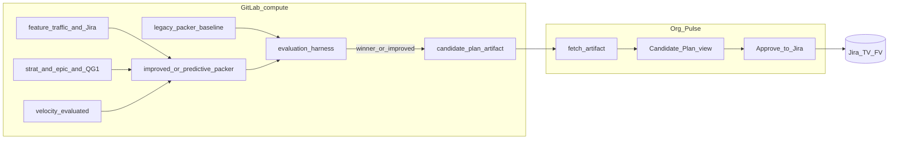
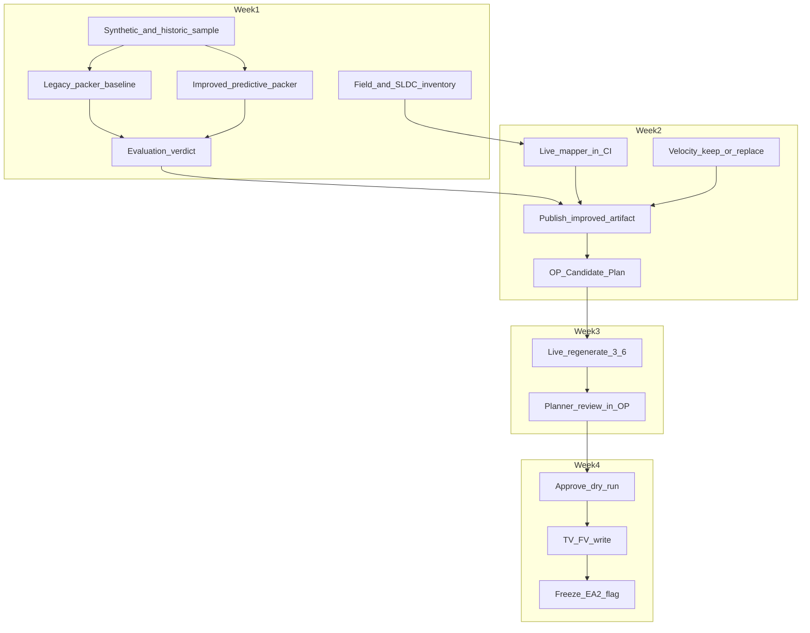

# DRAFT Work Plan: Release Planner MVP for 3.6 EA2

**Status:** DRAFT — for working-group alignment. No implementation commitment until John, Yuval, Eder, and Erle accept this plan.

**Target date:** 3.6 EA2 planning freeze (~August 26, 2026).

**Audience:** John Graham, Yuval Luria, Eder Ignatowicz, Erle Marion (with guidance from Tiffany / Sarah / Rick / Sherard as needed).

**Product families in scope (v1):** RHOAI, RHAII, and RHELAI.

---

## Purpose

Align on a four-week path so that by EA2 freeze we can:

1. Produce a **credible first-pass candidate schedule** (EA1 / EA2 / GA / Below cut) from Jira + AI SLDC signals.
2. Review it in **Org Pulse**.
3. **Approve to Jira** (write Target Version + Fix Version) for the freeze set.

This document supersedes treating the full Draft Plans red-pen product as the Aug 26 must-do. Draft Plans code may be reused in pieces; it is not the product surface for freeze.

---

## Problem we are solving

Today people debate the roadmap in meetings. The goal is: given strategy and Jira inputs, the tool produces a first-pass plan. People then fix inputs or rules, not argue feature order from scratch. By freeze, Plan Admin writes the agreed EA2 placements to Jira.

**John’s split (keep this in every demo):**

1. **Candidate schedule** — capacity + priorities → proposed placements (Weeks 1–3).
2. **Execution confidence** — will we really finish what we scheduled? (enrichment over time; not a freeze blocker if schedule + Approve land).

**Lesson from the failed first draft plan:** a workflow UI on top of a weak packer does not create trust. Credibility comes from the **schedule logic**, not from Org Pulse chrome.

---

## Recommended product shape (Option 2)

### Reuse (assets, not obligations)

| Existing asset | Reuse as |
| -------------- | -------- |
| GitLab **release-planning** (`prepare-features`, `auto_scheduler`, velocity, forecast) | Schedule compute — evaluate first; keep/fix/replace |
| **strat-pipeline** / data, **epic-decomposer** / data, QG1 labels | Readiness and preference signals into the packer |
| Org Pulse Jira client, feature-query, Plan tab shell | Auth, secrets, navigation, Approve write |
| Org Pulse **Draft Plans** | **Parts only** if useful (Plan Admin, audit, normalize, freeze flag) — not the full red-pen workflow |
| This repo’s docs | Glossary and field semantics |

Org Pulse remains a **display and light coordination layer**. Heavy packing stays in GitLab (or agentic-ci).

### UI options

| Option | Verdict |
| ------ | ------- |
| **1 — Full Draft Plans** (Create + red-pen + soft freeze + Approve) | Do **not** make this the must-do for Aug 26 |
| **2 — Thin “Candidate Plan”** in Org Pulse (recommended) | Load candidate artifact; show EA1/EA2/GA/Below cut, reasons, capacity warnings; Regenerate; Dry-run / Approve to Jira |
| **3 — Bolt onto Features List** | Escape hatch if Option 2 UI slips |

### Target architecture



**Artifact (one contract):** versioned JSON with `candidates[]`, `ceilingsByComponent`, `summary.byEvent`, readiness, `capacityWarning`, `productFamily`, plus metadata: `packerId`, `packerVersion`, `evaluatedAgainst`. Published from CI; Org Pulse displays and Approves.

---

## Non-negotiable: no primary component

The old approach selected or weighted a **primary component** (`components[0]` or similar) and drove packing from that. Features dropped off or were mis-placed.

**Rule:** There is **no primary-component concept** in the improved packer.

- Workload = **all** relevant components and teams on the Feature **and** delivery children/links.
- Incomplete Jira hygiene → Feature still appears with **explicit reasons** — not dropped, not assigned a fake primary.
- **Silent omission** of an in-scope Feature from the artifact is a defect.
- Capacity soft-warns if **any** contributing component/team is over ceiling; still show the Feature.

**Hard acceptance tests for the improved packer:**

1. No code path selects, sorts by, or gates on a single “primary” component.
2. Full delivery footprint from Feature + children/links.
3. Universe completeness (every in-scope open Feature/Initiative in EA1 / EA2 / GA / Below cut only).
4. Explainability for non-scheduled / warned rows.
5. Capacity uses the full component/team map.
6. Eval metrics: zero silent omissions; multi-component Features retain full workload maps; no `components[0]`-as-primary packing.

---

## End-state by week

| Week | End state |
| ---- | --------- |
| **1** (≈ Aug 3–7) | Packer evaluation of legacy prepare-features / auto_scheduler / velocity vs improved approach on synthetic (+ sample historic); field/SLDC inventory; keep/fix/replace verdict; QG1 CI onboarding started |
| **2** (≈ Aug 10–14) | Improved packer publishes the candidate artifact; velocity keep/fix/replace; Org Pulse Candidate Plan loads it; QG1 schedule + manual re-run live |
| **3** (≈ Aug 17–21) | Live regenerate for 3.6; Candidate Plan shows real keys, reasons, capacity/confidence warnings (MVP for freeze prep) |
| **4** (≈ Aug 24–28) | Dry-run then Approve to Jira (TV+FV); freeze/lock EA2 in the tool |



---

## AI SLDC signals (consume, do not reimplement)

| System | Role for planning |
| ------ | ----------------- |
| **strat-pipeline** / **strat-pipeline-data** | Labels + rubric scores on Features |
| **epic-decomposer** / data | Eng grounding, components on proposed epics — soft/structural helpers; not schedule of record |
| **release-planner-quality-gate (QG1)** | Writes `rp-qg1-*`; packer/Candidate Plan **read only** |
| **feature-traffic / Jira** | Universe of open Features + Initiatives |
| RFE Creator / Test Plan / AI-First Doc / UXD labels | Soft enrichment (from AI Core Dashboard report patterns) |

### QG1 — schedule, not manual-only

**Today:** QG1 is largely manual (`make run-dry` / `make run`). Coverage stays thin.

**Target:**

```text
All future-version signed-off features
  → QG1 on schedule (+ on-demand re-run)
  → rp-qg1-pass | rp-qg1-fail
  → packer / Candidate Plan consume labels (read-only)
```

| Rule | Detail |
| ---- | ------ |
| **Host** | GitLab `agentic-ci` — thin CI around existing quality-gate repo |
| **Schedule** | Frequent runs over **all future-version** signed-off features not already `rp-qg1-pass` |
| **On-demand** | Manual pipeline for “I just signed off / fixed fields — evaluate now” |
| **Producer vs consumer** | QG1 writes Jira; release-planning / Candidate Plan read only |
| **Hygiene link** | Component checks improve multi-component footprint; QG1 does not invent a primary component |

Week 1–2: Eder owns hosting start. Do not block Week 1 packer eval on QG1 — but live Week 3 credibility needs scheduled QG1 running for days.

---

## Capacity

- Prefer **per-event ceilings** (EA1 / EA2 / GA) per component after velocity method is evaluated.
- Soft warnings only in MVP.
- Do **not** use “AI-touched %” or throughput uplift as a capacity multiplier.
- AI Core Dashboard historical counts are a **sanity-check pattern** for one component, not the only capacity source.

### Team identity and team velocity (replace legacy assignee / first-component model)

**Verdict on current `fetch-team-velocity.py`:** flawed for packing. It maps one Feature → one team via assignee→`team-mapping.json` or **first component**. That ignores multi-team Features and child work.

**Canonical team footprint for a Feature** = unique teams from all of:

1. **Jira Team field** on the Feature (when set) — Org Pulse enrich already treats `customfield_10001` as Team in tests; confirm same field on child projects.
2. **Jira Team field** on child / linked delivery issues (whatever project they live in).
3. **Board membership** for those child issues — boards in **every Jira project that houses Feature children**, not a fixed shortlist. Discover projects from the child/link graph (today often includes RHOAIENG, RHAIENG, INFERENG, AIPCC, and others as the SLDC evolves); then resolve board → team for issues on those boards.

**Rules:**

- Union of sources; never collapse to a single “primary” team.
- Credit history **fractionally** across the team set (`1/N` or by child share); p75 of that series = team ceiling for EA1/EA2/GA.
- Components remain a parallel capacity axis (eng footprint); Team field + boards are the team axis.
- Missing Team field **and** no board attribution → Feature still listed with reason `missing_team_footprint` — do **not** fall back to Feature assignee or `components[0]`.
- Record `teamSource` on the artifact (`jira_team_field`, `board`, `both`, `none`) so methods are never silently mixed.
- Week 1–2 velocity keep/fix/replace must evaluate this footprint model vs legacy `fetch-team-velocity.py`.

**Board / sprint capacity producer (locked, 11 Aug):** use the **Jira Software Agile REST API** only — list boards in projects that house Feature children, resolve board→team, then:

- **Scrum:** closed sprints + sprint issues → completed story points (or issue counts) per sprint; aggregate to a team ceiling (e.g. p75).
- **Kanban:** throughput = issues completed in a time window on that board’s filter (no sprint velocity chart).

Do **not** depend on EazyBI or unofficial Greenhopper velocity-chart endpoints for MVP. Agile API feeds **team eng capacity** and board-based team attribution; Feature-per-event packing ceilings still come from historical Feature delivery attributed across the team footprint.

### Standalone capacity dataset (locked direction, 11 Aug)

Build a **standalone, continually refreshing producer** (own repo / package — **not** inside GitLab `release-planning` yet) that any release planner (Org Pulse, release-planning, future tools) can consume.

**Job of the producer:**

1. Pull scrum velocity + kanban throughput via **Jira Agile REST API** (boards in all projects that house Feature children).
2. Attribute work to **Jira Team field** (Feature and children); union with board→team where Team is sparse.
3. Correlate to **component(s)** on the same footprint (Feature + children).
4. Roll attribution up to **specific Features** (and keep team- and component-level rollups).
5. Publish a versioned, continually updating dataset (e.g. JSON artifacts + `fetchedAt` / schema version) suitable as **team-level capacity input** for future release packing.

**Non-goals for v1 of this standalone tool:** writing Jira; packing EA1/EA2/GA placements; Org Pulse UI; living inside `release-planning` CI.

**Local-first delivery:** ship a **standalone local CLI/project** first (run on a laptop with Jira creds) to generate the initial dataset and iterate on attribution. Schedule/CI and consumption by release-planning / Org Pulse come later.

**Capacity vs release (required distinction):** there is **one** continually updating capacity dataset — not a separate capacity product per release. **Inside** that dataset, **each release event has capacity data for each team** (e.g. for `3.6 EA1 RHOAI RELEASE`, team T’s throughput/velocity for that event; same for `3.5 EA2 RHAII RELEASE`, etc.).

Optional later: derive forecast summaries (e.g. p75 of a team’s past EA2s) from that release×team history when modeling a future event.

**Consumer contract (sketch):** one JSON artifact; structure is release event → `byTeam` (and correlated component/Feature detail), plus metadata (`source: agile_api`, lookback, schemaVersion). Packers only **read**.

---

## Recommended defaults (for group confirmation)

1. Org Pulse surface = **Option 2 (Candidate Plan)**; Option 3 only if UI time forces it.
2. Schedule compute in **GitLab**; Org Pulse displays and Approves.
3. **Do not trust legacy packer by default.** Week 1 evaluation → freeze artifact from **improved / predictive packer**.
4. **No primary component** (see above).
5. Predictive / improved scheduling is on the **critical path** for artifact credibility.
6. Synthetic + historic backtest Weeks 1–2; **live regenerate by end of Week 3**.
7. Product families: RHOAI + RHAII + RHELAI on one combined candidate artifact.
8. One CI JSON artifact with `packerId` / version metadata.
9. Structural gate: no component or no eng link → Below cut with reasons.
9a. **Team footprint:** Jira Team field (Feature + children) ∪ **board** membership in **all projects that house Feature children** (discovered from the child/link graph, not a fixed project list); never assignee / first-component as team; replace legacy `fetch-team-velocity.py`. Board/sprint capacity via **Jira Agile REST API** only (no EazyBI for MVP).
10. QG1 onboarded to agentic-ci with schedule + manual re-run.
11. Approve Week 4: Plan Admin dry-run then TV+FV write (no Draft Plans soft-freeze prerequisite).
12. **Out of scope through Week 4:** full Draft Plans red-pen/ACL, what-if side-by-side, Org Pulse-hosted heavy ML, local-only QG1 as steady state.

---

## Epic backlog (one epic per person per week)

**Split:** John = packer evaluation, improved/predictive pack algorithm, Approve write. Yuval = evaluation data/EDA, signals/mapper/velocity critique, Candidate Plan UI. Eder = SLDC + AI-first fit + QG1 hosting. Erle = trust/acceptance and freeze.

Suggested Jira naming: `[AIFP][W{n}][{Person}] {short title}` · labels `ai-first-planning`, `aifp-w1` … `aifp-w4`.

### Week 1 — Evaluate legacy; stand up improved packer on synthetic

| Epic | Assignee | Child work items |
| ---- | -------- | ---------------- |
| **C-W1-John — Packer evaluation + improved packer v0** | John | Kill primary-component paths in design; document legacy `components[0]` failure modes; improved packer v0 with full component+team footprint; zero silent omissions; compare to legacy |
| **C-W1-Yuval — Eval datasets + hygiene inventory + Jira** | Yuval | Synthetic multi-component / multi-team Features; harness (universe diff + full workload maps); hygiene field checklist; create AI First Jira from this backlog |
| **C-W1-Eder — SLDC + QG1 hosting start + model boundary** | Eder | Label/eng-link contracts; start agentic-ci onboarding of QG1; epic-decomposer footprint; review “no primary component” rule |
| **C-W1-Erle — Trust criteria + hygiene bar** | Erle | Accept no-primary / full-footprint rule; define credible-enough bar; prioritize ops hygiene; confirm Option 2 |

### Week 2 — Improved packer owns the artifact; Candidate Plan shows it

| Epic | Assignee | Child work items |
| ---- | -------- | ---------------- |
| **C-W2-John — Artifact from improved packer in CI** | John | CI publishes candidate JSON from improved packer; `packerId` metadata; optional legacy baseline artifact; regenerate path |
| **C-W2-Yuval — Live inputs + velocity + OP view + QG1 consumer** | Yuval | Live mapping; velocity keep/fix/replace; Candidate Plan loads improved artifact; surface `rp-qg1-*` + pointer to on-demand QG1 re-run |
| **C-W2-Eder — QG1 schedule live + architecture review** | Eder | QG1 scheduled + manual re-run live; compute-in-GitLab / display-in-OP; secrets |
| **C-W2-Erle — Candidate Plan acceptance** | Erle | UI understandable; packer credibility story clear; accept Week 2 |

### Week 3 — Live 3.6 with improved packer

| Epic | Assignee | Child work items |
| ---- | -------- | ---------------- |
| **C-W3-John — Live regenerate + packer hardening** | John | Live 3.6 run; capacity/confidence warnings; schema freeze; fix eval gaps |
| **C-W3-Yuval — Readiness UI + regenerate control** | Yuval | Reasons/warnings; Regenerate; freeze-meeting polish; optional confidence column |
| **C-W3-Eder — Live failure-mode review** | Eder | Partial data; go/no-go |
| **C-W3-Erle — MVP accept + Approve prep** | Erle | Accept live Candidate Plan as freeze draft; Approve gap list |

### Week 4 — Approve to Jira

| Epic | Assignee | Child work items |
| ---- | -------- | ---------------- |
| **C-W4-John — Approve dry-run + write** | John | TV+FV API; lineage; mocked tests |
| **C-W4-Yuval — Approve UI + audit + lock flag** | Yuval | Dry-run table; Approve; audit; frozen flag |
| **C-W4-Eder — Write safety go/no-go** | Eder | Permissions, guardrails |
| **C-W4-Erle — Freeze runbook + execution** | Erle | Runbook; Plan Admins; ~Aug 26; retrospective |

### Deliberately not on the Aug 26 must-do list

- Full Draft Plans red-pen / soft-freeze product
- Shipping the **legacy** packer as freeze default without evaluation
- What-if side-by-side
- Org Pulse-hosted heavy ML (models stay in GitLab / AI-first jobs)

---

## Related docs in this repo

- [GLOSSARY.md](./GLOSSARY.md)
- [ARCHITECTURE-CURRENT-STATE.md](./ARCHITECTURE-CURRENT-STATE.md)
- [DRAFT-RELEASE-PLANS-IMPLEMENTATION-PLAN.md](./DRAFT-RELEASE-PLANS-IMPLEMENTATION-PLAN.md) — historical locked Draft Plans path; treat as background, not the Aug 26 MVP surface
- [DRAFT-PLANS-DATA-CONTRACT.md](./DRAFT-PLANS-DATA-CONTRACT.md)
- [DATA-INVENTORY.md](./DATA-INVENTORY.md)

**Code homes:** [rhai-org-pulse](https://github.com/red-hat-data-services/rhai-org-pulse) (UI + Approve) · GitLab release-planning / agentic-ci (compute + QG1 hosting) · [release-planner-quality-gate](https://github.com/emarion1/release-planner-quality-gate) (QG1 checks)

---

## Confirmed directions (Erle) — pending group ack

- Org Pulse UI = thin Candidate Plan (Option 2)
- Approve to Jira required at freeze
- Improved/predictive packer on critical path for artifact credibility
- Draft Plans = optional code reuse only
- No primary-component packing

---

*Document version: DRAFT · 29 Jul 2026 · Author: Erle Marion*
